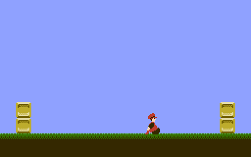

IF THIS FILE HAS NO LINE BREAKS:  View it in a web browser. 

SNROM template
==============

This is a minimal working program for the Nintendo Entertainment
System using the SGROM, SNROM, UNROM, or UOROM board.  It assumes
familiarity with [nrom-template].

Additional concepts illustrated:

* initializing the MMC1
* loading tile data into CHR RAM
* calls from one PRG bank to another

[nrom-template]: https://github.com/pinobatch/nrom-template

Setting up the build environment
--------------------------------
Building this demo requires cc65, Python, Pillow, GNU Make, and GNU
Coreutils.  For detailed instructions to set up a build environment,
see [nrom-template].

Organization of the program
---------------------------

### Include files

* `nes.inc`: Register definitions and useful macros
* `global.inc`: Global variable and function declarations

### Source code files

* `mmc1.s`: iNES header and driver for MMC1
* `unrom.s`: iNES header and driver for UNROM/UOROM
* `init.s`: PPU and CPU I/O initialization code
* `main.s`: Main program
* `bankcalltable.s`: List of entry points called through a far call
  (one that goes from one bank to another)
* `chrram.s`: CHR RAM data setup
* `bg.s`: Background graphics setup
* `player.s`: Player sprite graphics setup and movement
* `pads.s`: Read the controllers in a DPCM-safe manner
* `ppuclear.s`: Useful subroutines for interacting with the S-PPU

Greets
------

* [NESdev Wiki] and forum contributors
* [FCEUX] team
* Joe Parsell (Memblers) for getting me into NESdev in the first place
* Jeremy Chadwick (koitsu) for more code organization tips

[NESdev Wiki]: http://wiki.nesdev.com/
[FCEUX]: http://fceux.com/

Legal
-----
The demo is distributed under the following license, based on the
GNU All-Permissive License:

> Copyright 2011-2016 Damian Yerrick
> 
> Copying and distribution of this file, with or without
> modification, are permitted in any medium without royalty provided
> the copyright notice and this notice are preserved in all source
> code copies.  This file is offered as-is, without any warranty.
